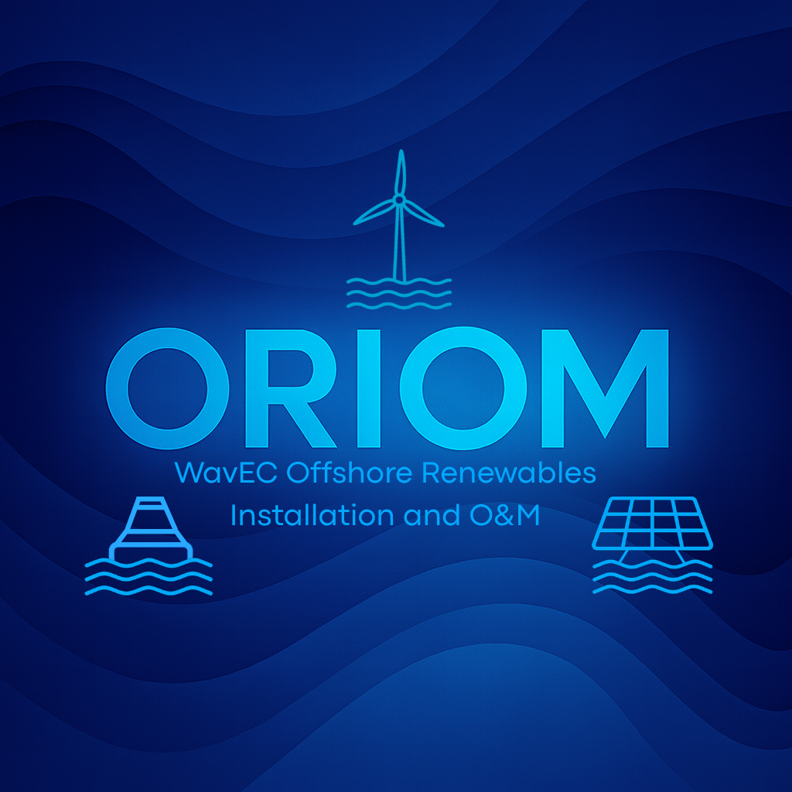
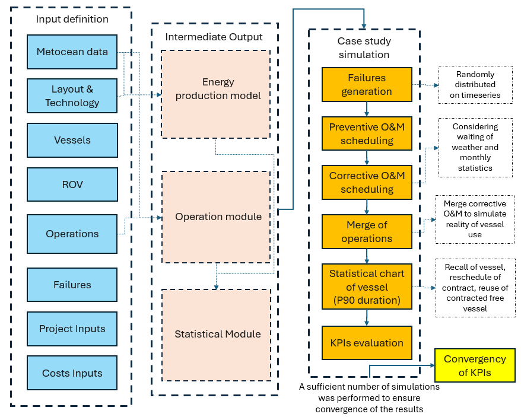

.. ORIOM documentation master file, created by
   sphinx-quickstart on Wed Jun  8 18:22:54 2022.
   You can adapt this file completely to your liking, but it should at least
   contain the root `toctree` directive.

Welcome to ORIOM's documentation!
=====================================

=============================

ORIOM - Offshore Renewables Installation and O&M

This is a Python based program to run and simulate long term Operation and Maintenance for offshore technologies desined by WavEC Offshore Renewables.

The main objective of the tool is to provide a comprehensive framework for simulating and optimizing the logistics and maintenance operations of offshore installations, taking into account various factors such as weather conditions, resource availability, and operational constraints.

ORIOM is designed to be modular and adaptable to different offshore technologies and operation strategies. It simulates long term O&M for offshore technologies for a past timeseries of metocean data along the project lifetime and estimetes the operational costs and downtime associated with different maintenance strategies with other relevant outputs.

This is the first open source version of ORIOM and is currently under active development, some functionality may still be incomplete. However, it is actively evolving and improving. Contributions are highly encouraged — whether it’s fixing small typos, adding new features, or enhancing tests. Issues and pull requests are very welcome!

Different feature consent to:
=============================

-  Use ORIOM as Installation module
===================================

-  Evaluate energy availability with statistical or timeseries O&M downtime impacts
===================================================================================

-  Modify and consider two different port distance for O&M
==========================================================

-  Effectuate sensitivity analysis on different inputs variables
================================================================

-  Evaluate statistical charting contract period for vessel based on durational percentile of operation to conduct (not available in open source mode)
======================================================================================================================================================

-  Reutilize vessels or recall vessel that have do not complete the operations inside the contracting chart time (not available in open source mode)
====================================================================================================================================================

-  Consider joint operations for different operations to optimize the O&M plan when possible 
============================================================================================

-  Intermediate results analysis 
================================

Tool flowchart
=====================================

.. toctree::
   :maxdepth: 2
   :caption: Contents:
   :titlesonly:

   Overview <overview>
=====================================

.. toctree::
   :maxdepth: 2
   :caption: Index
   :titlesonly:

   Classes package <_api/logistic_tools.classes>
   Core package <_api/logistic_tools.core>
   Inputs package <_api/logistic_tools.inputs>
   Utils package <_api/logistic_tools.utils>
   Main module <_api/logistic_tools.main>
